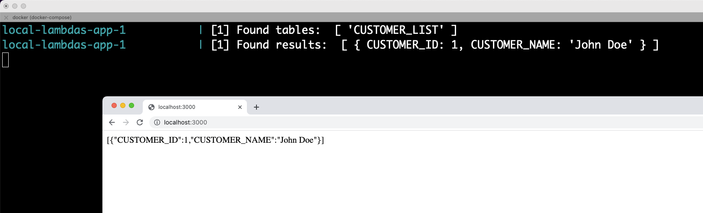

## Local Lambdas with DynamoDB

This repo servers the purpose of being able to run JS code (Express App) using AWS-SDK to interact with
a local instance of DynamoDB. It's not meant to be used in production.


It's assembly was made during a [live streaming on Youtube, click here to watch](https://www.youtube.com/watch?v=2fDD0qp-iKc&t=4200s)

WARNING: The GUI is a third party package and for some reason we didn't figure out why it seems
that the app connects to a different instance or database. DO NOT USE IT.

### How to run this repo

- You just need Docker installed.
- Make sure ports 3000, 8000 and 8001 are free.
- Clone the repository and run the docker-compose file.

```
git clone git@github.com:ijpatricio/local-lambdas.git

docker compose up
```

- Now, Visit this url after you get the output `[server]: Server is running at https://localhost:3000`

```
http://localhost:3000/create-table
```

- You may now visit the root path.

```
http://localhost:3000
```

